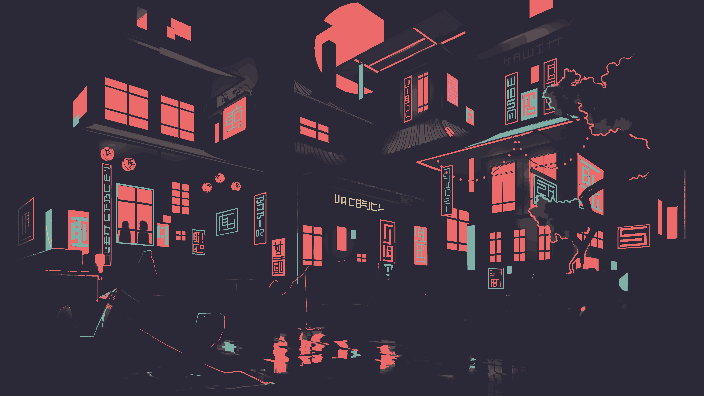
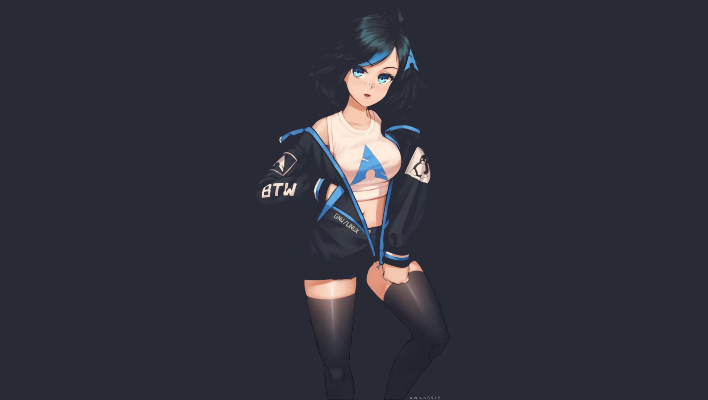
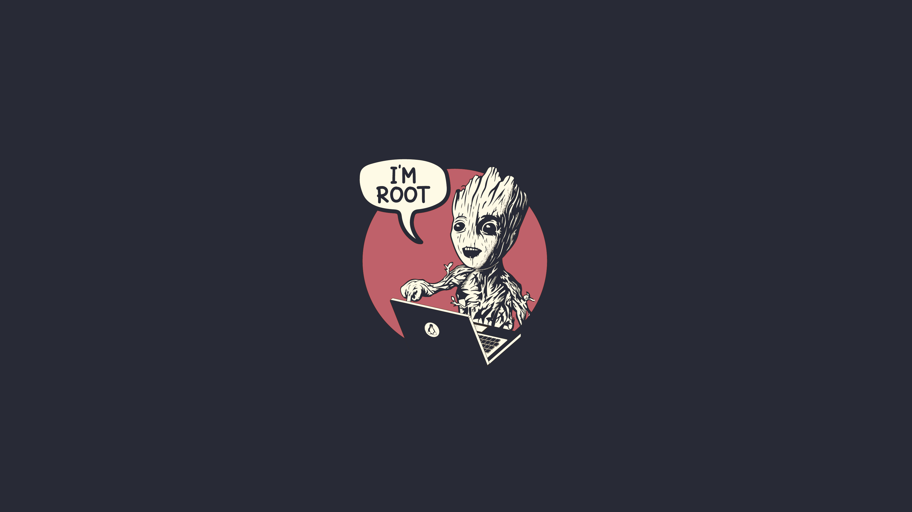
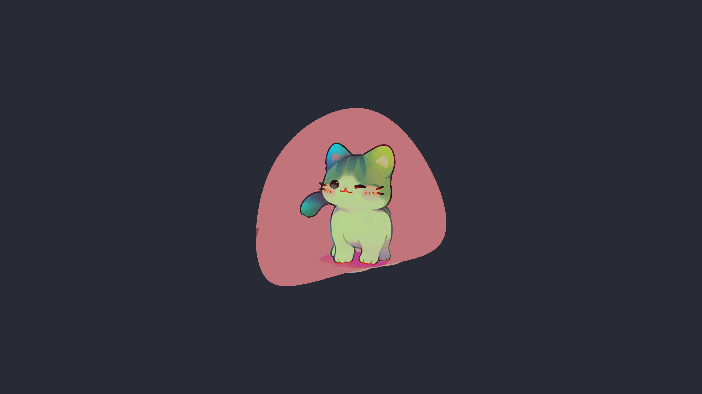
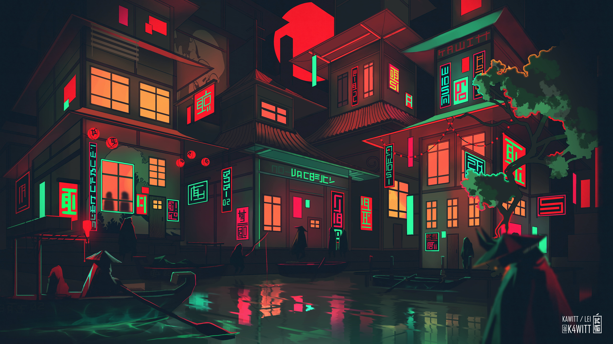
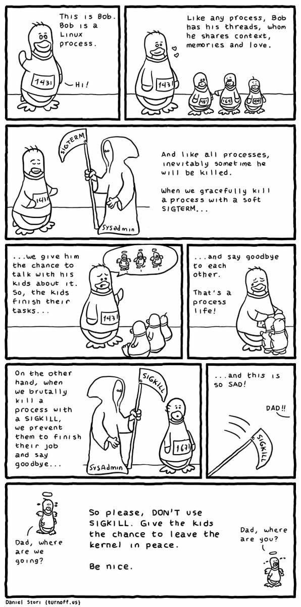

[My Dotfiles](https://github.com/TheSafdarAwan/Dotfiles.git) 

This is My curated wallpaper's collection which i collected from 

- Other Repos
- Reddit
- and from some wallpapers websites

<table>
    <tr>
        <td> </td>
        <td> </td>
        <td> </td>
    </tr> 
    <tr>
        <td> </td>
        <td> </td>
        <td> </td>
    </tr> 
    <tr>
        <td> </td>
        <td> </td>
        <td> </td>
    </tr> 
    <tr>
        <td> </td>
        <td> </td>
        <td> </td>
    </tr> 
    <tr>
        <td> </td>
        <td> </td>
        <td> </td>
    </tr> 
    <tr>
        <td> </td>
        <td> </td>
        <td> </td>
    </tr> 
    <tr>
        <td> </td>
        <td> </td>
        <td> </td>
    </tr> 
    <tr>
        <td> </td>
        <td> </td>
        <td> </td>
    </tr> 
    <tr>
        <td> </td>
        <td> </td>
        <td> </td>
    </tr> 
    <tr>
        <td> </td>
        <td> </td>
        <td> </td>
    </tr> 
    <tr>
        <td> </td>
        <td> </td>
        <td> </td>
    </tr> 
    <tr>
        <td> </td>
        <td> </td>
        <td> </td>
    </tr> 
    <tr>
        <td> </td>
        <td> </td>
        <td> </td>
    </tr> 
    <tr>
        <td> </td>
        <td> </td>
        <td> </td>
    </tr> 
    <tr>
        <td> </td>
        <td> </td>
    </tr> 
</table>
<table>
    <h3 style="color: #E5C07B;">Cartoon's Wallpapers</h3>
    <tr>
        <td> </td>
        <td> </td>
    </tr>
</table>

<table>
    <h3 style="color: #E06C75;">Meme's</h3>
    <tr>
        <td> </td>
        <td> </td>
    </tr>
</table>
